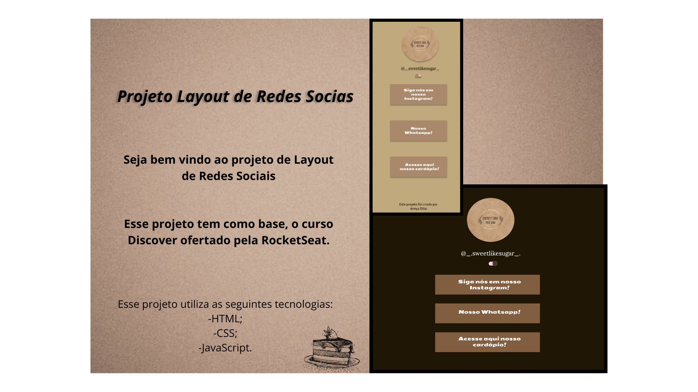

<h1 align="center"> Layout Confeitaria Sweet Like Sugar </h1>

Projeto que tem como fim ser um agrupador de Links, facilitando a comunicação de cliente a uma confeitaria virtual.

  <a href="#-tecnologias">Tecnologias</a>&nbsp;&nbsp;&nbsp;|&nbsp;&nbsp;&nbsp;
  <a href="#-projeto">Projeto</a>&nbsp;&nbsp;&nbsp;|&nbsp;&nbsp;&nbsp;
  <a href="#-layout">Layout</a>&nbsp;&nbsp;&nbsp;&nbsp;&nbsp;&nbsp;

  

 

## 🚀 Tecnologias

Esse projeto foi desenvolvido com as seguintes tecnologias:

- HTML e CSS
- JavaScript
- Git e Github

## 💻 Projeto

Esse projeto foi desenvolvido com o fim de ser um agrupador de links de uma confeitaria virtual. Ajudando na comunicação do cliente ao usuário em suas encomendas virtuais, possui como característca a troca das cores do ambiente desenvovido através de um botão.

## 🔖 Layout

Você pode visualizar o layout do projeto através [DESSE LINK](https://www.figma.com/design/4qIqawIATsd4zTHASyHx3C/Projeto-Layout?node-id=0-1&p=f&t=6s1QnLcTYPrIjkCl-0). É necessário ter conta no [Figma](https://figma.com) para acessá-lo.

Link para acessar a página na Web referente ao projeto: https://github.com/annyaotto/Layout.SLS
